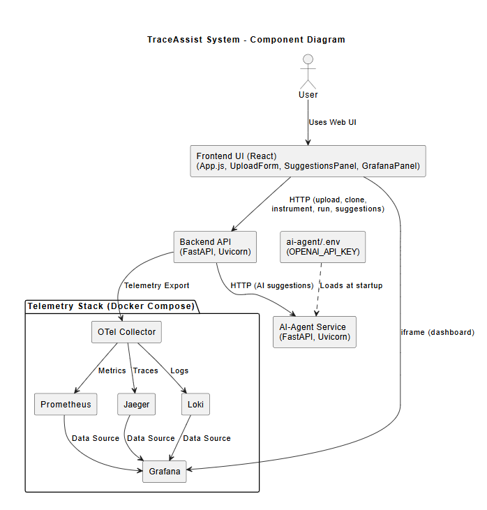

# 🚀 TraceAssist

**AI-powered, zero-touch auto-instrumentation & observability platform**  
Instrument any Python, Node.js or Java app, get AI-driven tips, and view metrics, logs & traces in Grafana—all locally in one click.

---

## 📖 Table of Contents

1. [Overview](#overview)  
2. [Architecture & Features](#architecture--features)  
3. [Tech Stack](#tech-stack)  
4. [Prerequisites](#prerequisites)  
5. [Environment Configuration](#environment-configuration)  
6. [Quick Setup](#quick-setup)  
7. [Running the App](#running-the-app)  
8. [Using the UI](#using-the-ui)  
9. [Exercising Your App](#exercising-your-app)  
10. [API Reference](#api-reference)  
11. [Observability & Dashboards](#observability--dashboards)  
12. [Troubleshooting](#troubleshooting)  
13. [Cleanup](#cleanup)  
14. [Further Reading](#further-reading)  

---

## Overview

TraceAssist lets you:

- 🎯 **Auto-instrument** Python, Node.js or Java apps without touching code  
- 🤖 **AI Suggestions** to improve your observability  
- 📊 **Unified UI**: view metrics (Prometheus), logs (Loki) & traces (Jaeger) in Grafana  
- ⚡ **One-click setup**: run everything locally with `run.sh`

---

## Architecture & Features

<!-- <p align="center">
  
</p> -->

- **Frontend (React)**: upload ZIP or GitHub URL → instrument → run → visualize  
- **Backend (FastAPI)**: handles uploads, cloning, instrumentation, Dockerfile & compose generation  
- **AI-Agent**: calls OpenAI to suggest code instrumentation improvements  
- **Telemetry Stack** (Docker Compose):
  - **OpenTelemetry Collector**  
  - **Prometheus** (metrics)  
  - **Loki** (logs)  
  - **Jaeger All-in-One** (traces)  
  - **Grafana** (dashboard)  



---

## Tech Stack

| Layer          | Technology                                            |
| -------------- | ----------------------------------------------------- |
| Frontend       | React, Vite, Axios, Tailwind CSS                      |
| Backend        | FastAPI, Uvicorn, GitPython                           |
| AI-Agent       | FastAPI, OpenAI Python SDK                            |
| Instrumentation| OpenTelemetry auto-instrumentation scripts (Bash)     |
| Telemetry      | OTel Collector Contrib, Prometheus, Loki, Jaeger      |
| Dashboard      | Grafana                                               |
| Orchestration  | Docker & Docker Compose                               |

---

## Prerequisites

Ensure you have installed:

- **Git**  
- **Docker & Docker Compose** (v1.27+)  
- **Node.js 18+** & **npm**  
- **Python 3.9+** & **pip**

---

## Environment Configuration

1. **Clone** this repository:
   ```bash
   git clone https://github.com/harshit-jindal02/traceAssist.git
   cd traceAssist
   ```

2. Create your OpenAI key file for the AI-Agent and backend:

   ```bash
   cat <<EOF > ai-agent/.env
   OPENAI_API_KEY=sk-<YOUR_OPENAI_API_KEY>
   EOF
   cat <<EOF > backend/.env
   OPENAI_API_KEY=sk-<YOUR_OPENAI_API_KEY>
   EOF
   ```

---

## Quick Setup

Make the startup script executable and run it:

```bash
chmod +x run.sh
./run.sh
```

This will:

- 🚢 Launch the telemetry stack (Collector, Prometheus, Grafana, Jaeger, Loki)
- 🐍 Create & install Python venvs for Backend & AI-Agent
- 🚀 Start:
  - **Backend API** → [http://localhost:8000](http://localhost:8000)
  - **AI-Agent** → [http://localhost:8200](http://localhost:8200)
- 🌐 Install & serve Frontend UI → [http://localhost:5173](http://localhost:5173)

Logs are written to `backend.log`, `ai-agent.log`, and `frontend.log`.

---

## Running the App

| Service              | URL                                           |
|----------------------|-----------------------------------------------|
| Frontend UI          | [http://localhost:5173](http://localhost:5173)|
| Backend API (Swagger)| [http://localhost:8000/docs](http://localhost:8000/docs)|
| AI-Agent API (Swagger)| [http://localhost:8200/docs](http://localhost:8200/docs)|
| Grafana              | [http://localhost:3000](http://localhost:3000) (admin/admin)|
| Prometheus           | [http://localhost:9090](http://localhost:9090)|
| Jaeger UI            | [http://localhost:16686](http://localhost:16686)|
| Loki (Logs)          | [http://localhost:3100](http://localhost:3100)|

---

## Using the UI

Open your browser at [http://localhost:5173](http://localhost:5173):

- Upload a ZIP file or Clone a GitHub repo (Python, Node.js, Java)
- Click **Submit** → note your returned `app_id`
- Click **Instrument & Run** → the container will be built and started
- **AI Suggestions** appear in the panel below
- Scroll further down to see the **Grafana Dashboard** embedded

---

## Exercising Your App

Generate traffic to produce telemetry data:

```bash
# Default port for Node sample: 5000
curl http://localhost:5000/
curl http://localhost:5000/fail

# Load test
for i in {1..20}; do curl -s http://localhost:5000/; done
```

For Python or Java, adjust port accordingly (e.g. `8000`).

---


## 📖 API Reference

| Method | Path | Payload | Description |
| ------ | ---- | ------- | ----------- |
| POST   | `/upload` | form-data: `file=*.zip` | Upload & extract a ZIP archive |
| POST   | `/clone` | JSON `{ "repo_url": "...", "branch": "main" }` | Clone a GitHub repository |
| POST   | `/instrument` | JSON `{ "app_id": "<id>" }` | Auto-instrument & generate Dockerfiles |
| POST   | `/run` | JSON `{ "app_id": "<id>" }` | Launch the user app via Docker Compose |
| GET    | `/suggestions` | Query `?app_id=<id>` | Fetch AI-driven instrumentation suggestions |

---

## 📊 Observability & Dashboards

### Add Data Sources in Grafana

- **Prometheus**
  - URL: [http://localhost:9090](http://localhost:9090)
- **Loki**
  - URL: [http://localhost:3100](http://localhost:3100)
- **Jaeger**
  - URL: [http://localhost:16686](http://localhost:16686)

Click **Save & Test** for each → you should see “Data source is working”.

---

## ⚠️ Troubleshooting

### No AI suggestions / 502
Ensure AI-Agent is running on port `8200` and its `/suggest` endpoint returns valid JSON.

### Network “telemetry” not found
Rerun:
```bash
./run.sh
```
or manually create network:
```bash
docker network create telemetry
```

### Port conflicts
Stop any services using ports `5173`, `8000`, `8200`, `3000`, `9090`, `16686`, `3100`.

### Container startup errors
Check logs:
```bash
tail -f backend.log ai-agent.log frontend.log
docker logs <container_name>
```

---

## 🧹 Cleanup

After testing, tear down and remove local resources:

```bash
# Stop background processes
pkill -f "uvicorn backend.main"
pkill -f "uvicorn ai-agent.main"
pkill -f "npm run dev"

# Stop & remove telemetry stack
cd telemetry
docker-compose down
cd ..

# Remove Docker network
docker network rm telemetry

# Remove virtual environments & logs
rm -rf backend/venv ai-agent/venv
rm -f backend.log ai-agent.log frontend.log

# Remove generated user apps
rm -rf user-apps
```

---

## 📚 Further Reading

- [OpenTelemetry Documentation](https://opentelemetry.io/docs/)
- [Grafana Observability](https://grafana.com/docs/grafana/latest/)
- [FastAPI Tutorial](https://fastapi.tiangolo.com/tutorial/)
- [React Documentation](https://react.dev/)

✨ **All set! Enjoy end-to-end observability with TraceAssist!** 🎉
